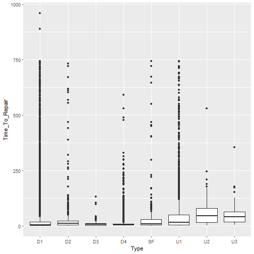
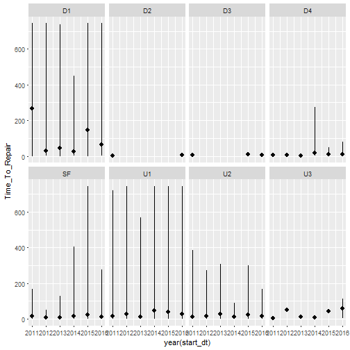

### Examining the causes of Power Plant Outages with respect to Frequency, nmber of outages, and Severity, duration of outages.

This study will examine the causes of US power plant outages based on the following data from the North American Electrical Reliability Corporation (NERC) Generating Availability Data System (GADS).
* CC_GT_2011_2017.csv - Combined Cycle Power Plants
* GT_Jet_Engine_2013_2016.csv - Simple Cycle Power Plants
* Fossil_steam_2013_2017.csv - Fossil Fuel Fired Boiler Steam Power Plants

My goal is determine which types of equipment failures are most responsible for unplanned/forced outages for each of these three types of plants.  To do this, I will have to do further examine the field Cause_Code, using the metadata associated with each four character code and chunking it into higher level or less granular categories.


With respect to outage type, "Type" / column 4, the following should be ignored as they are planned or maintenance outages and derates.
* MO - Maintenance Outage
* PE - Planned Extension
* PD - Planned Derate
* PO - Planned Outage
* RS - Reserve Shutdown

The first wrangling step is to clean the column names.


I wanted to create standard POSIX.ct date fields from the character fields in the data frames.


```
## Warning: 5 failed to parse.

## Warning: 5 failed to parse.
```

I created new data frames with only the desired fields.


I created data frames converting the Cause_Codes to character fields in the event I wanted to do a join with the NERC GADS appendix codes.


Since I am focusing on unplanned outages, I used the following to filter each data set (fossil fuel steam shown as an example) to include only unplanned derates: D1, D2, D3, start up failures: SF, and unplanned full outages: U1, U2, U3.


```
## Error in ff_steam_df(.): could not find function "ff_steam_df"
```

```
## # A tibble: 8 x 2
##   Type  Mean_TTR_Type_cc
##   <chr>            <dbl>
## 1 D1               89.8 
## 2 U3               31.1 
## 3 U1               29.4 
## 4 U2               16.9 
## 5 SF               12.7 
## 6 D4                8.41
## 7 D3                6.87
## 8 D2                4.33
```

```
## # A tibble: 8 x 2
##   Type  Mean_TTR_Type_ss
##   <chr>            <dbl>
## 1 U1                62.2
## 2 SF                58.5
## 3 U2                58.1
## 4 U3                53.9
## 5 D1                37.7
## 6 D2                33.2
## 7 D4                11.1
## 8 D3                10.7
```

```
## Warning: Removed 3 rows containing non-finite values (stat_boxplot).
```


```
## Warning: Removed 3 rows containing non-finite values (stat_summary).
```



Given that there are hudreds of cause codes, Cause_Code, for each type of power plant, I grouped them by plant system, System, base on the NERC GADS appendix files.


My next step is to create dummy numeric variables for each System type. This should allow me to begin using additional statistical methods.
I used the following code to assign numeric variables to per above.


I examinded the following distribution plots in order to set probable maximal loss (PML) at > 10 days, 240 hours, and <= 30 days, 720 hours, as well as maximum forseeable loss (MFL) at greater that 30 days.


I used the following code to experiment with logistic regression for predicting (or showing an association wit) PML events by System.


Experimenting with logistic regression for MFL


