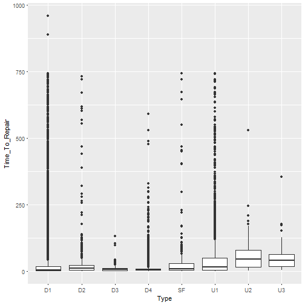
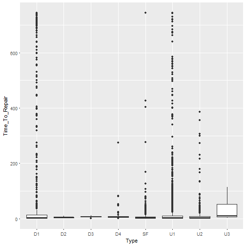
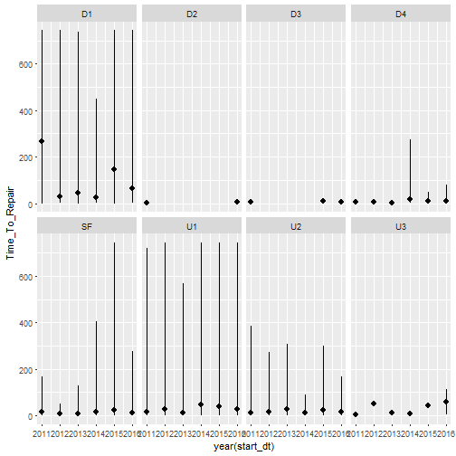
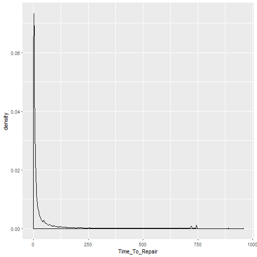
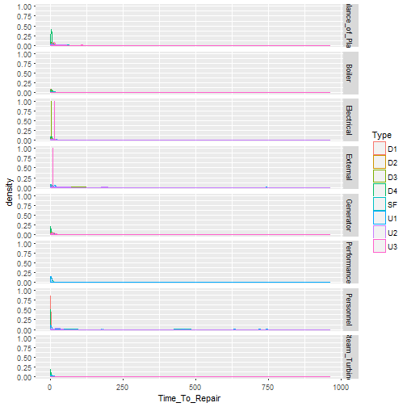
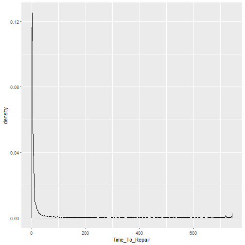
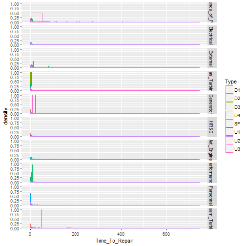
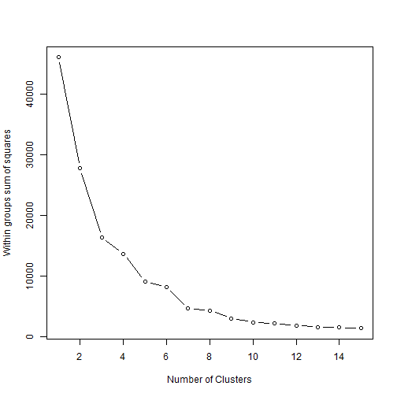
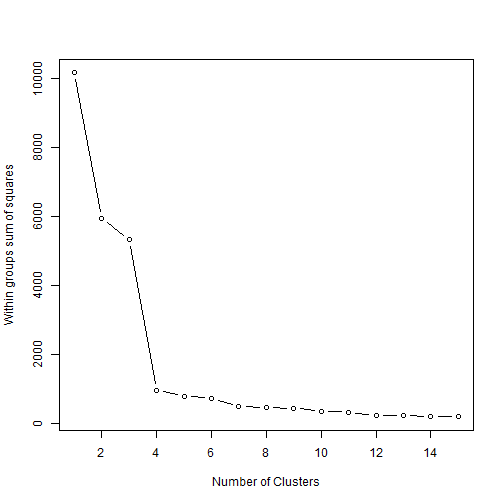

### Examining the causes of Power Plant Outages with respect to Frequency, nmber of outages, and Severity, duration of outages.

This study will examine the causes of US power plant outages based on the following data from the North American Electrical Reliability Corporation (NERC) Generating Availability Data System (GADS).
* CC_GT_2011_2017.csv - Combined Cycle Power Plants
* GT_Jet_Engine_2013_2016.csv - Simple Cycle Power Plants
* Fossil_steam_2013_2017.csv - Fossil Fuel Fired Boiler Steam Power Plants

My goal is determine which types of equipment failures are most responsible for unplanned/forced outages for each of these three types of plants.  To do this, I will have to do further examine the field Cause_Code, using the metadata associated with each four character code and chunking it into higher level or less granular categories.


With respect to outage type, "Type" / column 4, the following should be ignored as they are planned or maintenance outages and derates.
* MO - Maintenance Outage
* PE - Planned Extension
* PD - Planned Derate
* PO - Planned Outage
* RS - Reserve Shutdown

The first wrangling step is to clean the column names.


I wanted to create standard POSIX.ct date fields from the character fields in the data frames.


```
## Warning: 5 failed to parse.

## Warning: 5 failed to parse.
```

I created new data frames with only the desired fields.


Since I am focusing on unplanned outages, I used the following to filter each data set (fossil fuel steam shown as an example) to include only unplanned derates: D1, D2, D3, start up failures: SF, and unplanned full outages: U1, U2, U3.


```
## # A tibble: 8 x 2
##   Type  Mean_TTR_Type_ff
##   <fct>            <dbl>
## 1 U1                62.2
## 2 SF                58.5
## 3 U2                58.1
## 4 U3                53.9
## 5 D1                37.4
## 6 D2                33.2
## 7 D4                11.1
## 8 D3                10.7
```

```
## # A tibble: 8 x 2
##   Type  Mean_TTR_Type_cc
##   <fct>            <dbl>
## 1 D1               89.8 
## 2 U3               31.1 
## 3 U1               29.4 
## 4 U2               16.9 
## 5 SF               12.7 
## 6 D4                8.41
## 7 D3                6.87
## 8 D2                4.33
```

```
## Warning: Removed 3 rows containing non-finite values (stat_boxplot).
```



```
## Warning: Removed 3 rows containing non-finite values (stat_summary).
```


```
## Warning: Removed 3 rows containing non-finite values (stat_boxplot).
```


```
## Warning: Removed 3 rows containing non-finite values (stat_summary).
```


Given that there are hudreds of cause codes, Cause_Code, for each type of power plant, I grouped them by plant system, System, base on the NERC GADS appendix files.


My next step is to create dummy numeric variables for each System type. This should allow me to begin using additional statistical methods.
I used the following code to assign numeric variables to per above.


I examinded the following distribution plots in order to set probable maximal loss (PML) at > 10 days, 240 hours, and <= 30 days, 720 hours, as well as maximum forseeable loss (MFL) at greater that 30 days.


```
## Warning: Removed 3 rows containing non-finite values (stat_density).
```



```
## Warning: Removed 3 rows containing non-finite values (stat_density).
```




I used the following code to experiment with logistic regression for predicting (or showing an association wit) PML events by System.


Experimenting with logistic regression for MFL

After discussion with my course Mentor, Dhiraj, we refined the logistic regression approach.


```
## 
## Call:
## glm(formula = PML ~ System, family = "binomial", data = ff_steam_dfb)
## 
## Deviance Residuals: 
##     Min       1Q   Median       3Q      Max  
## -0.8559  -0.2562  -0.2171  -0.1803   2.8731  
## 
## Coefficients:
##                     Estimate Std. Error z value Pr(>|z|)    
## (Intercept)          -4.1110     0.1023 -40.171  < 2e-16 ***
## SystemBoiler          0.3748     0.1217   3.080  0.00207 ** 
## SystemElectrical      0.6375     0.2490   2.560  0.01047 *  
## SystemExternal        0.7111     0.1419   5.012 5.39e-07 ***
## SystemGenerator       1.2695     0.2018   6.292 3.14e-10 ***
## SystemPerformance     3.2955     0.1597  20.638  < 2e-16 ***
## SystemPersonnel       0.9491     0.3011   3.152  0.00162 ** 
## SystemSteam_Turbine   1.3863     0.1443   9.608  < 2e-16 ***
## ---
## Signif. codes:  0 '***' 0.001 '**' 0.01 '*' 0.05 '.' 0.1 ' ' 1
## 
## (Dispersion parameter for binomial family taken to be 1)
## 
##     Null deviance: 6320.2  on 23068  degrees of freedom
## Residual deviance: 5898.4  on 23061  degrees of freedom
## AIC: 5914.4
## 
## Number of Fisher Scoring iterations: 6
```

```
##         (Intercept)        SystemBoiler    SystemElectrical 
##          0.01639067          1.45468085          1.89179229 
##      SystemExternal     SystemGenerator   SystemPerformance 
##          2.03621405          3.55893424         26.99073233 
##     SystemPersonnel SystemSteam_Turbine 
##          2.58349810          4.00003884
```

```
## 
## Call:
## glm(formula = PML ~ System, family = "binomial", data = cc_dfb)
## 
## Deviance Residuals: 
##     Min       1Q   Median       3Q      Max  
## -0.8167  -0.2097  -0.2097  -0.1555   3.5425  
## 
## Coefficients:
##                     Estimate Std. Error z value Pr(>|z|)    
## (Intercept)          -6.2729     0.7073  -8.869  < 2e-16 ***
## SystemElectrical      2.7938     0.8047   3.472 0.000516 ***
## SystemExternal        1.8637     0.8382   2.223 0.026191 *  
## SystemGas_Turbine     2.4668     0.7251   3.402 0.000669 ***
## SystemGenerator       2.4963     0.8190   3.048 0.002303 ** 
## SystemHRSG            2.1975     0.7920   2.774 0.005530 ** 
## SystemJet_Engine      2.8942     0.9192   3.149 0.001641 ** 
## SystemPerformance     5.3461     0.7244   7.380 1.58e-13 ***
## SystemPersonnel       2.3345     0.9165   2.547 0.010862 *  
## SystemSteam_Turbine   3.4459     0.7456   4.621 3.81e-06 ***
## ---
## Signif. codes:  0 '***' 0.001 '**' 0.01 '*' 0.05 '.' 0.1 ' ' 1
## 
## (Dispersion parameter for binomial family taken to be 1)
## 
##     Null deviance: 1352.7  on 5086  degrees of freedom
## Residual deviance: 1112.6  on 5077  degrees of freedom
## AIC: 1132.6
## 
## Number of Fisher Scoring iterations: 8
```

```
##         (Intercept)    SystemElectrical      SystemExternal 
##        1.886794e-03        1.634360e+01        6.447682e+00 
##   SystemGas_Turbine     SystemGenerator          SystemHRSG 
##        1.178431e+01        1.213739e+01        9.002114e+00 
##    SystemJet_Engine   SystemPerformance     SystemPersonnel 
##        1.806816e+01        2.097914e+02        1.032466e+01 
## SystemSteam_Turbine 
##        3.137068e+01
```
While this doesn't have much predictive value with respect to failure rates and Time_To_Repair, from an equipment breakdown insurance perspective, it does show which systems will most likely result in a PML breakdown event.  I could use this in cooperation with our actuarial department to refine our rating for these risks.

Dhiraj and I also experimented with K-means clustering on this data.



```
## [1] 18323     6  2284  1194   108   538   616
```

```
##   Time_To_Repair TBF_Period_Hrs
## 1    -0.23325621     -0.2440190
## 2     0.08230229     32.2748011
## 3    -0.21676744      0.8736810
## 4     1.54321226     -0.2264844
## 5    -0.09675434      7.6447126
## 6     5.61544108     -0.1940699
## 7    -0.13749470      2.9727723
```

```
##   cluster Time_To_Repair TBF_Period_Hrs
## 1       1       12.99733       25.32929
## 2       2       46.94667     9732.98667
## 3       3       14.77127      358.98989
## 4       4      204.11857       30.56380
## 5       5       27.68287     2380.30722
## 6       6      642.22903       40.24032
## 7       7       23.29982      985.61961
```

```
##                   
##                       1    2    3    4    5    6    7
##   Balance_of_Plant 5057    0  536  208   22   45  147
##   Boiler           7879    3 1237  520   53  130  312
##   Electrical        491    2   66   49    7   26   24
##   External         2719    1  253  165   11  106   58
##   Generator         471    0   53   47    3   40   21
##   Performance       153    0    5   56    1   95    3
##   Personnel         247    0   31    2    3   19   18
##   Steam_Turbine    1306    0  103  147    8   77   33
```

```
##         ARI 
## 0.004410025
```



```
## [1] 1683  207 3197
```

```
##   Time_To_Repair TBF_Period_Hrs
## 1     -0.2061712      1.2700984
## 2      4.6145302     -0.4899217
## 3     -0.1902476     -0.6368976
```

```
##   cluster Time_To_Repair TBF_Period_Hrs
## 1       1       11.04585      6685.0719
## 2       2      637.73464      1222.1546
## 3       3       13.11591       765.9568
```

```
##                   
##                       1    2    3
##   Balance_of_Plant  420    1  641
##   Electrical         93    5  136
##   External          171    9  236
##   Gas_Turbine       615   51 1173
##   Generator          67    5  196
##   HRSG              132    8  339
##   Jet_Engine         20    3   68
##   Performance        31   87   83
##   Personnel          50    4  103
##   Steam_Turbine      84   34  222
```

```
##        ARI 
## 0.01150624
```
Based on the indicies at close to 0, as well as the clustering showing heavy concentrations in one or two clusters, these models are not very useful.

This would have been more useful with the following types of data.
* Hours running prior to failure
* Number of starts and stops in the years prior to and between failure
* Plant maintenance expenditures
* Plant overhaul and maintenance schedules: number of daily, weekly, monthly maintenance items, number of major overhauls performed, etc.


